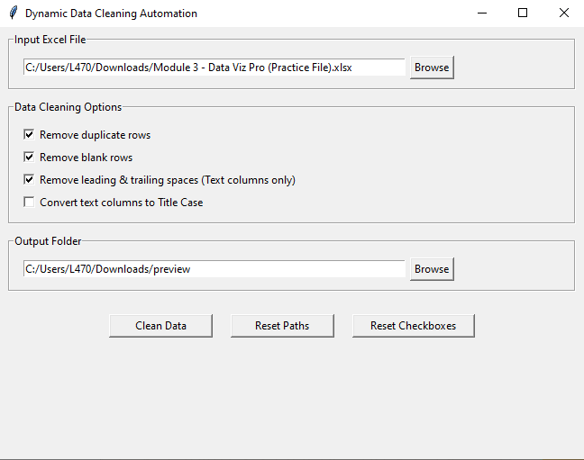

# 🧹 Dynamic Data Cleaning Automation

An AI-assisted automation project designed to simplify and accelerate data cleaning workflows using Prompt Engineering techniques. This project demonstrates how Generative AI can be leveraged to automate repetitive preprocessing tasks with minimal manual coding

---

# 📌 Project Overview

Data cleaning is one of the most time-consuming stages in data analysis and machine learning workflows. This project was developed as part of a Prompt Engineering learning module, where the automation workflow was developed and refined using Prompt Engineering techniques and AI-assisted development practices.

The application is designed to:
- Handle missing values
- Remove duplicate records
- Standardize inconsistent data
- Improve preprocessing efficiency
- Automate repetitive cleaning operations

This project highlights the practical integration of:
- Prompt Engineering
- Generative AI
- Automation Workflows
- Data Preprocessing

---

# 🚀 Features

✅ AI-Assisted Data Cleaning  
✅ Automated Missing Value Handling  
✅ Duplicate Record Removal  
✅ Data Formatting & Standardization  
✅ Beginner-Friendly Interface  
✅ Reusable Automation Workflow  
✅ Improved Data Consistency  

---

# 🛠️ Technologies Used

- Python
- Pandas
- NumPy
- Prompt Engineering
- Generative AI Concepts
- Visual Studio Code

---

# 📸 Project Screenshots

## 🔹 Application Interface

---

# ⚙️ How It Works

The automation pipeline performs the following operations:

1. Import dataset
2. Detect missing/null values
3. Remove duplicate entries
4. Standardize inconsistent formats
5. Clean and preprocess the dataset
6. Export cleaned data

---
# 💡 Why This Project

This project was created to explore how Prompt Engineering and Generative AI can accelerate repetitive data preprocessing workflows. 

The goal was to understand how AI-assisted development can improve productivity, reduce manual effort, and simplify common data cleaning operations for end users.

---
# 🎯 Key Learning Outcomes

- Understanding Prompt Engineering workflows
- Exploring AI-assisted automation
- Building preprocessing pipelines
- Applying Generative AI concepts in practical scenarios
- Improving workflow efficiency through automation

---

## End User Accessibility

The application is designed for non-technical users and can be used without any programming knowledge.

A standalone Windows executable (.exe) version of the application is also available, allowing users to run the software without installing Python or development tools.

## Connect

For executable access, collaboration, or project discussions, feel free to connect:
https://www.linkedin.com/in/prem-sai-856404406/

---

# ⭐ If you found this project interesting, consider giving it a star!
